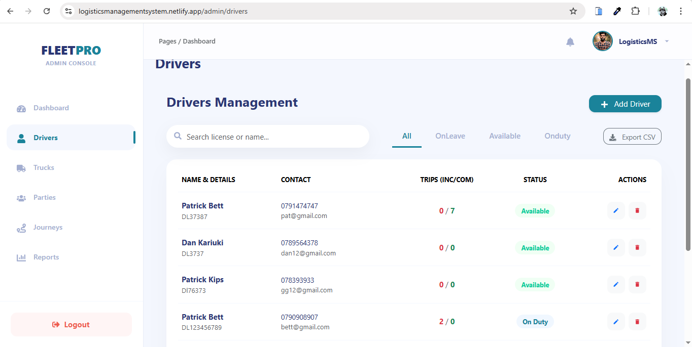

# Logistics Management System.

## Admin Dashboard

This project is a logistics management dashboard built with React and Django.
It allows administrators to monitor drivers, trucks, journeys, and parties in one place.

## Features

1. Perform all CRUD Operations on drivers, trucks, journeys/order, and parties

2. Track drivers currently on leave

3. Visualize trips per driver using charts

4. Responsive UI built with Bootstrap
5. Schedule online meeting with all drivers or a single driver

## Tech Stack

Frontend: React, Bootstrap, CSS, Rechart

Backend: Django, Django REST Framework

This dashboard is intended for internal administrative use.

