# Logistics Management System.

A role-based logistics management platform built with React (frontend) and Django + Django REST Framework (backend). The system allows logistics companies to manage drivers, trucks, journeys, and clients efficiently from a centralized dashboard.

The platform provides separate interfaces for administrators and drivers, enabling operational visibility, better fleet management, and improved communication
### Administrators can:

1. Manage drivers and fleet resources

2. Track journeys and orders

3. Manage clients/parties

4. Generate operational reports

5. Schedule meetings with drivers

### Drivers can:

1. Access their personal dashboard

2. View assigned trucks

3. Monitor assigned journeys

Driver registration is restricted — **drivers can only register after being added by an administrator**, ensuring controlled system access.

## Features

1. Perform all CRUD Operations on drivers, trucks, journeys/order, and parties

2. Track drivers currently on leave

3. Visualize trips per driver using charts

4. Responsive UI built with Bootstrap
5. Schedule online meeting with all drivers or a single driver

## Tech Stack

1. Frontend: React, Bootstrap, CSS, Rechart, Context API

2. Backend: Django, Django REST Framework, Redis, Celery

3. Notification: Africastalking API

## Login Page
Login Page for both Admin and Driver
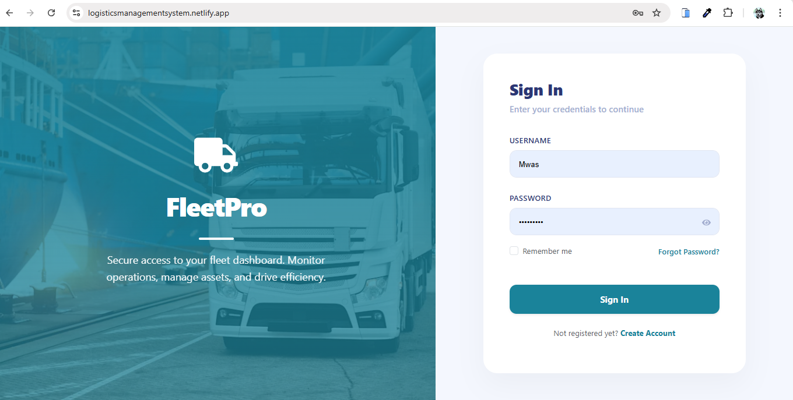

## RegisterPage
This is the registration page where Drivers register their account after being employed and his details saved by admin
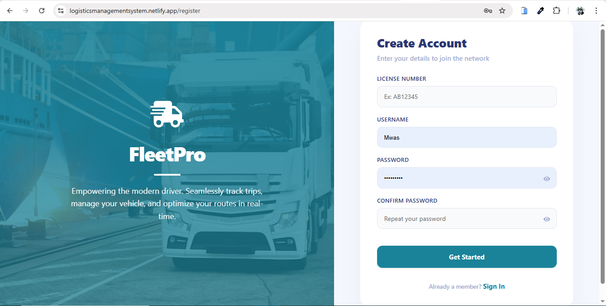

## Admin Dashboard
This dashboard is intended for internal administrative use.
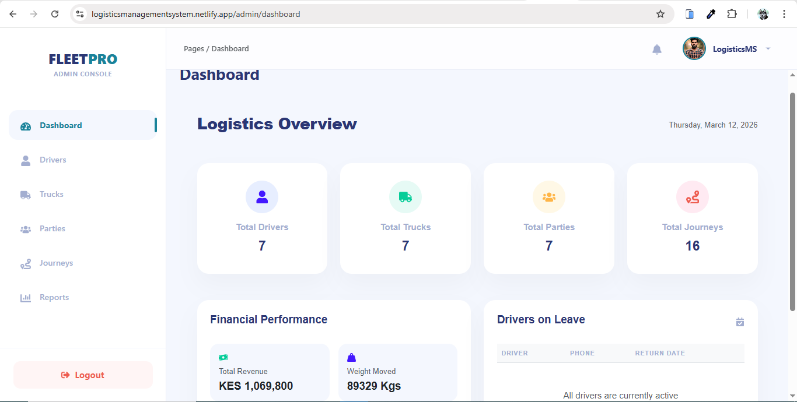

## Drivers Management
1. Create, update, and delete drivers
2. Track driver availability
3. Monitor drivers currently on leave
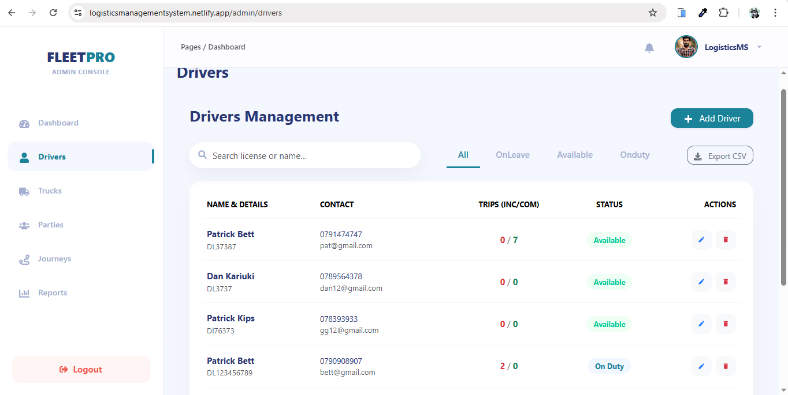

## Trucks/Fleet Management
1. Manage trucks and fleet resources
2. Assign trucks to drivers
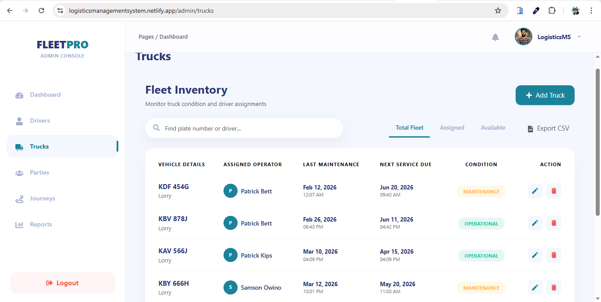

## Parties/Clients Management
1. Maintain client/party records
2. Associate journeys with parties
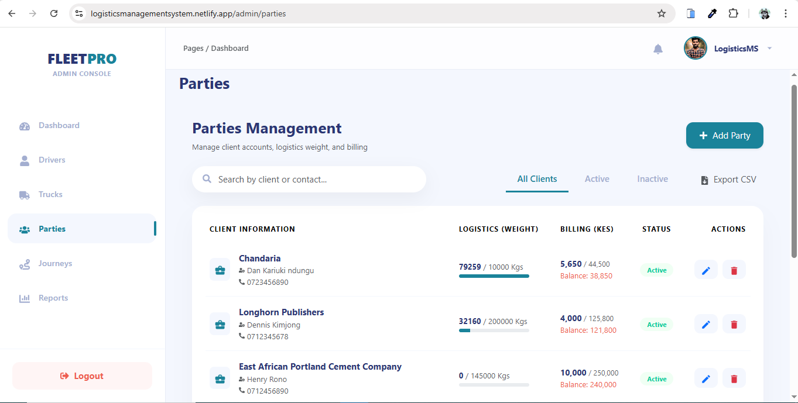

## Journey Management
1. Create and manage journeys
2. Track trips assigned to drivers
3. Monitor delivery operations
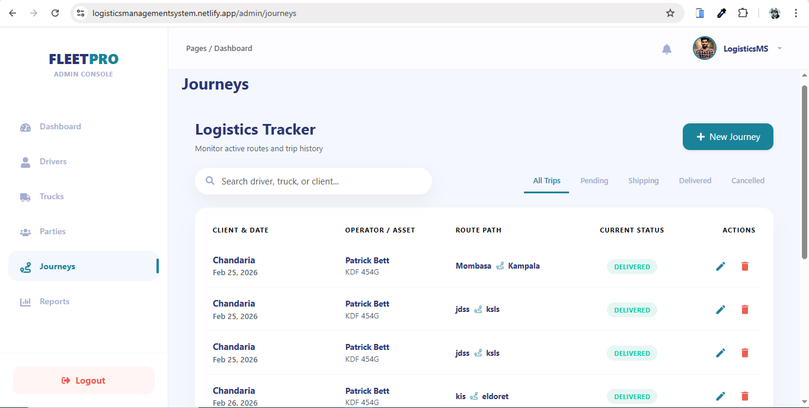

## Report Management
1. Visualize trips per driver using charts
2. Monitor operational activity from the dashboard
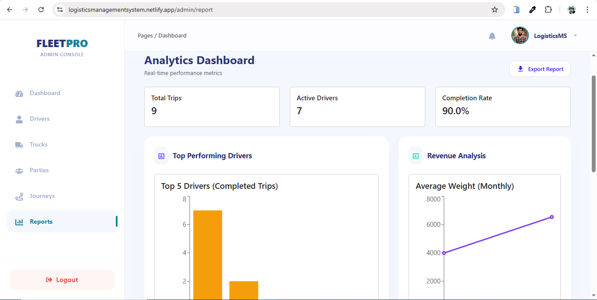

## Driver Dashboard
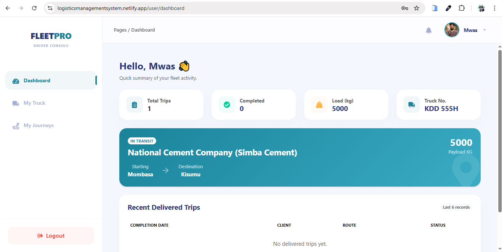
## Driver Assigned Truck
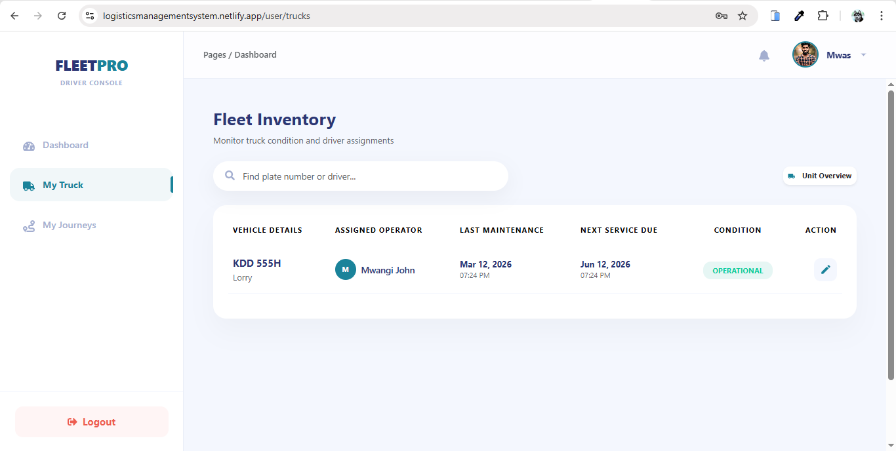
## Driver JourneysS
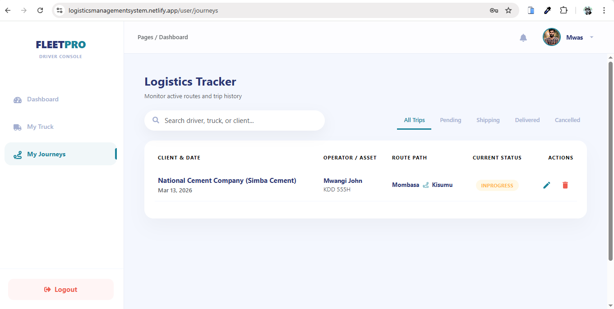

## This starts Celery Beat, the scheduler
celery -A backend beat --loglevel=info

## To Start a Celery worker process.
celery -A backend worker -l info